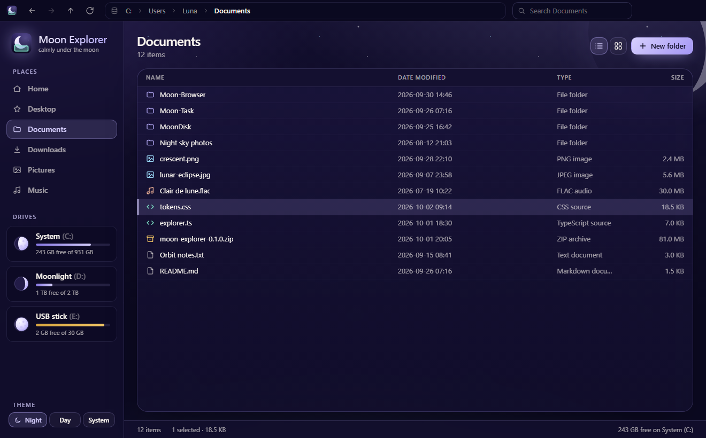

# Moon-Explorer

Moon Explorer – your files, calmly under the moon. A file explorer in the
Luna-OS "Moon" family (MoonDisk, MoonTask, Moon Browser).



## Development

```sh
npm install
npm run dev        # Vite dev server on http://localhost:1420
npm run build      # typecheck + production build
npm test           # vitest
npm run lint
```

## Theme

All styling lives in `src/theme/` with `src/theme/tokens.css` as the single
source of truth. See [docs/theme.md](docs/theme.md) for the shared Moon
palette, typography and components, and which sibling app each value comes from.
