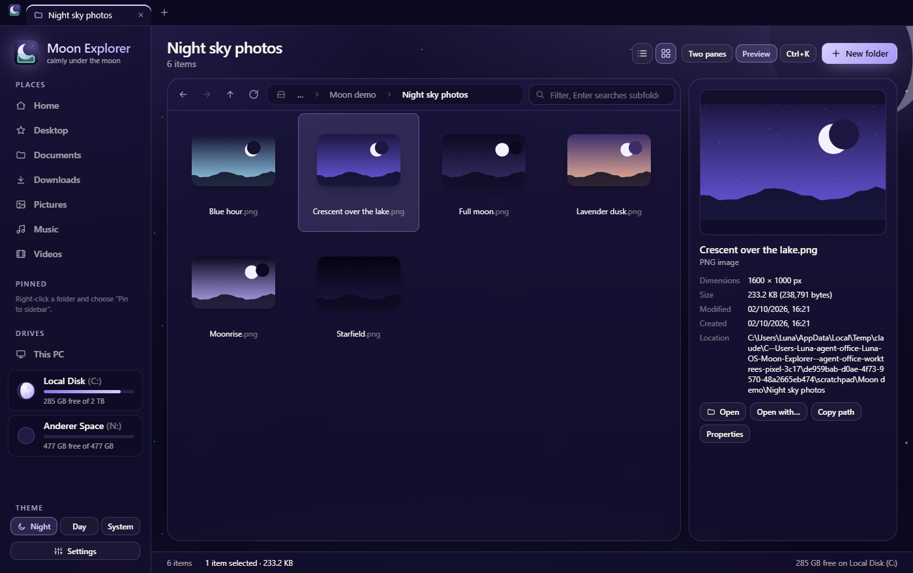
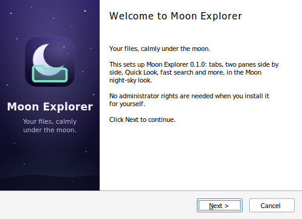

# Moon-Explorer

Moon Explorer – your files, calmly under the moon. A file explorer for Windows in the
Luna-OS "Moon" family (MoonDisk, MoonTask, Moon Browser).



## Run the desktop app

```sh
npm install
npm run app        # build the UI and start the Electron app on your real files
npm run app:dev    # the same with the Vite dev server and hot reload
```

## Package it

```sh
npm run dist
```

This writes to `release/`:

- `Moon-Explorer-Setup-<version>.exe`: the Windows installer (per user, no admin rights, Start menu and desktop shortcut)
- `Moon-Explorer-<version>-win-x64.zip`: a portable build; unzip it and run `Moon Explorer.exe`

The installer has the Moon look (a night-sky picture on the welcome and finish pages, the logo in the
page header), and its last page offers **Use as default file manager**. Uninstalling gives folders back
to Windows Explorer first. Its pages are in `build/installer.nsh`.



`npm run icons` re-renders the app icons in `build/` from `public/moon-explorer-logo.svg`, and the
installer pictures (`build/*.bmp`) from `build/installer/*.svg`.

### Release

Set the version in `package.json` (`npm version <x.y.z> --no-git-tag-version`), write the notes in
`docs/releases/v<x.y.z>.md`, merge, then push the tag `v<x.y.z>`. The Release workflow
(`.github/workflows/release.yml`) checks and tests the code on Windows, builds the installer and
the ZIP, and publishes them as a GitHub release with those notes.

## Development

```sh
npm run dev        # the UI alone in a browser (http://localhost:1420), on an in-memory demo file system
npm run build      # typecheck + production build
npm test           # vitest
npm run lint
```

## What it does

Tabs, two panes side by side, a command palette, Quick Look, live search through subfolders
(also inside files), folder sizes, bulk rename, undo, ZIP and more. See
[docs/desktop-app.md](docs/desktop-app.md) for the features, the keyboard shortcuts and how the
pieces fit together.

## Default file manager

**Settings → Use as default file manager** lets folders, drives, This PC and Win+E open in Moon Explorer
instead of Windows Explorer (per user, no admin rights, switch back any time). See
[docs/default-file-manager.md](docs/default-file-manager.md).

## Theme

All styling lives in `src/theme/` with `src/theme/tokens.css` as the single
source of truth. See [docs/theme.md](docs/theme.md) for the shared Moon
palette, typography and components, and which sibling app each value comes from.

## Custom drive icons

Right-click a drive and choose **Change icon…** to give it a built-in icon,
a tint or your own image. See [docs/drive-icons.md](docs/drive-icons.md).

## Language

The app UI and everything in this repository (code, identifiers, comments,
tests, docs, commit messages, pull requests) are in English, even when a
request is written in another language. See [CLAUDE.md](CLAUDE.md).
