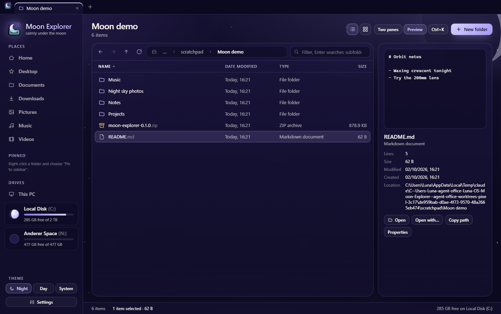
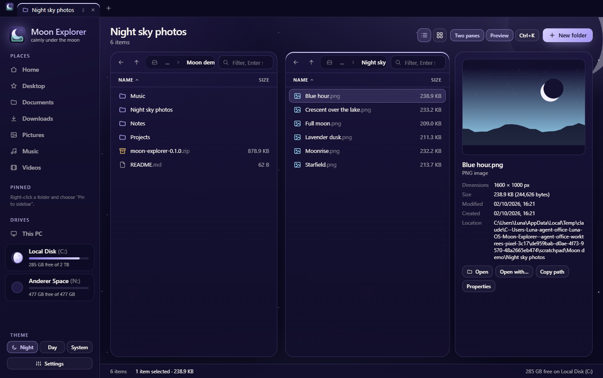

# The desktop app

Moon Explorer runs as an Electron app on Windows. The React UI in `src/` is the only UI. In the
desktop app it works on the real file system; in a plain browser (`npm run dev`) and in the tests
it uses an in-memory demo file system with the sample content.

## Features

| | |
| --- | --- |
| **Tabs** | Ctrl+T, Ctrl+W, Ctrl+Tab, Ctrl+1…9. Drag to reorder, middle-click to close, Ctrl+Shift+T reopens a closed tab. Tabs come back at the next start. |
| **Two panes** | F9 shows two folders side by side; Tab switches between them. Right-click → *Copy / Move to the other pane*. |
| **Command palette** | Ctrl+K: every command, place, drive, pinned and recent folder, and the files of the current folder, with fuzzy search. A typed path (`C:\…`, `%APPDATA%`, `~`, `shell:downloads`) opens directly. |
| **Quick Look** | Space shows the selection big: images, videos, audio, PDFs, fonts, text and code. Arrow keys move through the folder. |
| **Preview panel** | Alt+P. Image dimensions, video and audio length, text and JSON, PDFs, font samples, folder contents, and Windows' own thumbnails for everything else. |
| **Search** | Typing in the box filters the folder (words or patterns like `*.pdf`). Enter searches all subfolders live; *Search file contents* also looks inside text files. |
| **Big folders** | The list only renders the visible rows, so folders with thousands of files stay smooth. |
| **File operations** | Copy, cut and paste (also with Windows Explorer through the clipboard), drag and drop in and out of the app, a conflict dialog (*Replace*, *Keep both*, *Skip*), progress with *Cancel* in the status bar, Recycle Bin or permanent delete. |
| **Undo** | Ctrl+Z undoes renames, moves, copies and new files or folders. |
| **Rename** | F2 renames in place. With several items selected it opens bulk rename: a pattern with `{name}`, `{n}`, `{date}`, `{folder}`, find and replace (with regular expressions) and letter case, with a live preview. |
| **Selection tools** | *Select by pattern…* selects names like `*.jpg` or `IMG_2026*` (several patterns separated by `;`). *New folder with selection…* moves the selected items into a new folder (one Ctrl+Z puts them back). *Copy name* copies just the names, without the path. |
| **Checksums** | Right-click a file → *Checksums…* shows its SHA-256, SHA-1 and MD5, each with a copy button, and checks a pasted value against them, e.g. to verify a download. |
| **ZIP** | *Compress to ZIP*, *Extract here* and *Extract to “name”* (ZIP, TAR, GZ and more through Windows' own `tar`). |
| **Folder sizes** | *Show folder sizes* adds them to the size column, calculated in the background. |
| **Places and drives** | The sidebar shows your folders, pinned folders and every drive with its fill level and custom icon (see [drive-icons.md](drive-icons.md)). Free space is shown the way Windows shows it ("145 GB free of 1.81 TB") and is checked again when the window comes back to the front, after copying, moving or deleting, once a minute, and with the refresh button next to the drives (or F5 in This PC). |
| **Windows integration** | *Open in Terminal*, *Open with…*, *Show in Windows Explorer* and Windows' own *Properties* dialog. Hidden files follow Windows' hidden attribute (Ctrl+H shows them). Moon Explorer can also be the [default file manager](default-file-manager.md). |

## Keyboard shortcuts

| Keys | Action |
| --- | --- |
| Ctrl+K, Ctrl+Shift+P, F1 | Command palette |
| Ctrl+T / Ctrl+W / Ctrl+Tab | New tab / close tab / next tab |
| Ctrl+Shift+T | Reopen the closed tab |
| F9, Tab | Two panes, switch pane |
| Ctrl+L, Alt+D, F4 | Edit the path |
| Ctrl+F, F3 | Filter or search |
| Space | Quick Look |
| Alt+Left / Alt+Right / Alt+Up, Backspace | Back / forward / up, back |
| Enter, Ctrl+Enter | Open, open in a new tab |
| F2 | Rename (bulk rename for several items) |
| Ctrl+Shift+N | New folder |
| Ctrl+C / Ctrl+X / Ctrl+V | Copy / cut / paste |
| Ctrl+Shift+C | Copy path |
| Del / Shift+Del | Recycle Bin / delete permanently |
| Ctrl+Z | Undo |
| Ctrl+A / Ctrl+I | Select all / invert selection |
| Ctrl+H | Hidden files |
| Alt+P | Preview panel |
| Ctrl+Shift+1 / Ctrl+Shift+2, Ctrl+Plus / Ctrl+Minus | Details / icon view, icon size |
| Alt+Enter | Properties |
| Type letters | Jump to the first matching name |

## How it fits together

| Path | What it is |
| --- | --- |
| `electron/main.cjs` | The main process: the window (custom title bar, native window buttons in the theme's frame colors), file-system access, copy / move / delete tasks with progress, search, folder sizes, folder watching, and the `moon-file://` protocol that serves local files to the previews. |
| `electron/preload.cjs` | The bridge (`window.moon`). Its shape is `MoonBridge` in `src/fs/types.ts`. |
| `electron/start.cjs` | Turns the command line (a folder, a file, a drive root, `--this-pc`) into what to open. |
| `electron/default-file-manager/` | Registers Moon Explorer as the default file manager and back (see [default-file-manager.md](default-file-manager.md)). |
| `src/fs/` | The bridge types, Windows path helpers, formatting, and `DemoBridge`, the in-memory file system for the browser and the tests. |
| `src/explorer/model/` | Plain TypeScript models: `PaneModel` (location, history, listing, filter, sort, selection, search) and `Workspace` (tabs, clipboard, undo, tasks, dialogs, settings). Components subscribe with `useStore`. |
| `src/explorer/` | The views: `FileView` (virtualized list and icon grid), `PathBar`, `PaneView`, `Preview`, `Dialogs`, `Overlays` (palette, Quick Look, toasts) and `commands.tsx` (menus and shortcuts). |

Settings (view, sort, pinned and recent folders, open tabs) are kept in `localStorage` under
`moonexplorer.settings`.

### Screenshots

`MOON_SHOT=<folder> MOON_SCRIPT=<file.js> npx electron .` starts the app with a separate profile,
runs the script in the UI (it gets `shot(name)` and `wait(ms)`, and the workspace as
`window.__moon`), saves the screenshots and quits. That is how the pictures in `docs/` were made.

## Default file manager

**Settings → Use as default file manager** makes folders, drives, *This PC* and Win+E open in Moon Explorer
instead of Windows Explorer, for the current user and without admin rights, and switches back just as easily.
The installer offers the same on its last page. See [default-file-manager.md](default-file-manager.md) for what it
changes in the registry, the safety rules and how to undo it by hand.
