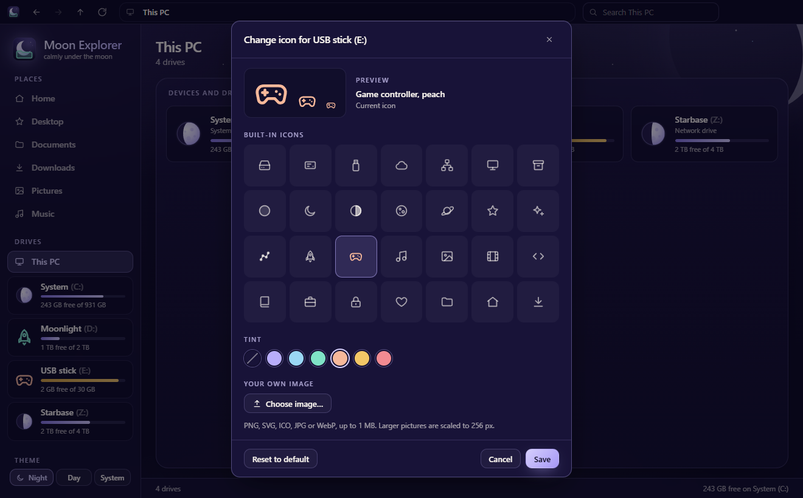
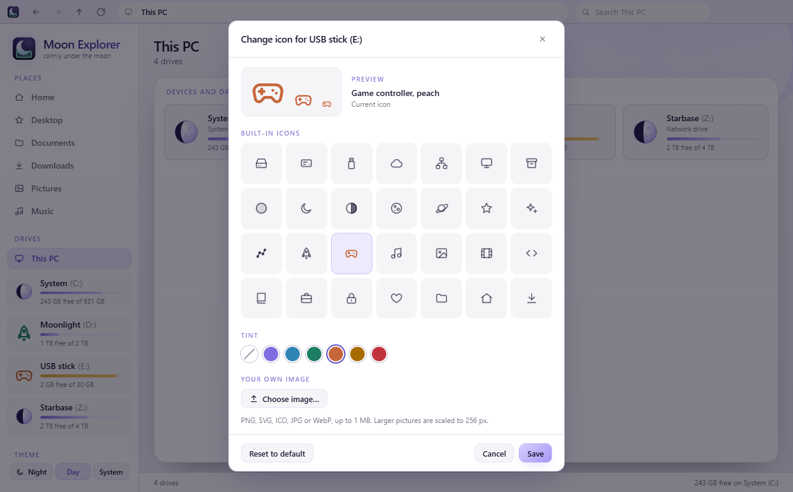
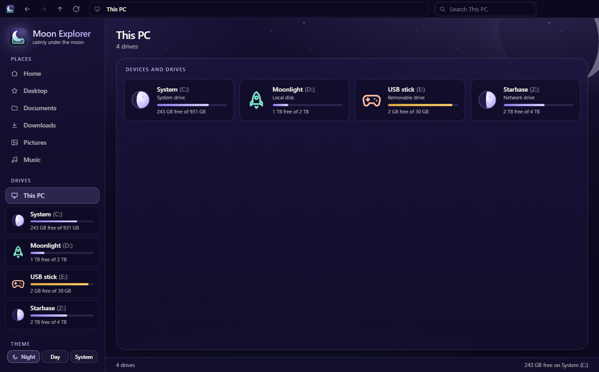
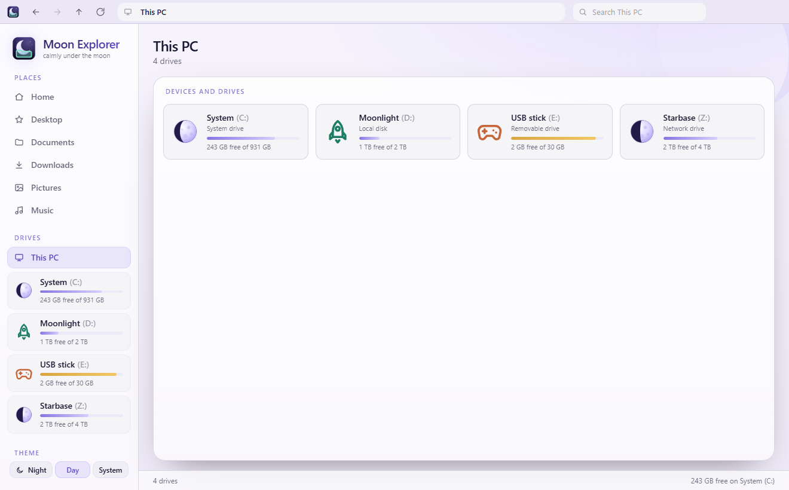

# Custom drive icons

Every drive (C:, D:, USB sticks, network drives, …) can get its own icon.
The choice is saved per drive and survives a restart.

| Night | Day |
| --- | --- |
|  |  |
|  |  |

## Using it

- **Right-click a drive** in the sidebar or in **This PC** and choose **Change icon…**.
  From the keyboard, focus the drive and press **Shift+F10** or the **Menu** key.
- Or open the drive, click **Properties**, and choose **Change icon…** there.
  The properties dialog also has **Reset to default** once a drive has a custom icon.

The picker offers:

- **Built-in icons**: 28 line icons in the Moon style (drives, moon phases,
  planet, stars, rocket, game controller, music, photo, code, …).
- **Tint**: an optional color from the Moon palette for a built-in icon.
- **Choose image…**: your own PNG, SVG, ICO, JPG or WebP, up to 1 MB.
  PNG, JPG and WebP images bigger than 256 px are scaled down to 256 px before
  they are saved, and images smaller than 16 px are refused.
- **Reset to default**: back to the drive's normal icon.

Nothing changes until **Save**; **Cancel** or **Escape** closes without saving.

## Where the icon shows

The custom icon replaces the default everywhere a drive appears: the sidebar,
the **This PC** view, the heading and the path bar of an open drive, and the
properties dialog. Without a custom icon:

- the big slots (sidebar, This PC) show the **moon-phase gauge** of how full the drive is,
- the small inline slots (path bar, heading) show the **line icon for the drive's kind**:
  a hard drive for system and local disks, a USB stick for removable drives,
  and a network icon for network drives.

The app has no tabs yet. When it gets them, a tab for a drive should render
`<DriveIcon drive={drive} size={14} />` the same way the path bar does.

## Accessibility

- The picker is a modal dialog with a title. Focus moves into it, **Tab** stays
  inside, **Escape** closes it, and focus goes back to the drive afterwards.
- The gallery and the tints are radio groups with one tab stop each. The arrow
  keys move the selection (up and down move by a row in the gallery), and
  **Home** and **End** jump to the first and last item.
- Every gallery icon and tint has a name (`aria-label` and a tooltip). The
  preview has alt text that says which icon it shows, and the choice is also
  announced in a live region.
- The drive menu follows the WAI-ARIA menu pattern (arrow keys, Home/End,
  Escape).
- Next to a drive's name the icon is decorative (`aria-hidden`), so screen
  readers don't read the drive twice.

## How it is built

The code lives in [`src/drive-icons/`](../src/drive-icons/):

| File | What it does |
| --- | --- |
| `store.ts` | `DriveIconStore`, the storage interface; `createLocalDriveIconStore`, its localStorage version; `driveKey` |
| `context.ts` | `DriveIconStoreContext` to swap the store, and the `useDriveIconChoice` hook |
| `builtins.ts` | The gallery, the default icon per drive kind, and the tints |
| `image.ts` | Checks an uploaded file and turns it into a data URL |
| `DriveIcon.tsx` | Renders a drive's icon (custom or default) |
| `DriveIconPicker.tsx` | The "Change icon…" dialog |

The gallery icons themselves are in `src/theme/icons.tsx` with the rest of the
icon set. The tints are `--me-tint-*` tokens in `src/theme/tokens.css`, with a
night and a day value each.

### Drive key

Icons are saved under `driveKey(drive)`:

- `volume:<id>` when the drive has a `volumeId` (the volume serial / ID from
  the OS). This keeps a USB stick's icon when it comes back under another letter.
- `letter:<X:>` otherwise. The sample data has no volume IDs yet, so for now
  the letter is used. Once the file-system layer fills in `Drive.volumeId`,
  icons saved under a letter will need to be moved over (or set again).

### Storage

`DriveIconStore` has four methods: `get`, `set`, `reset` and `subscribe`.
The app only uses this interface, so the desktop shell can replace the
localStorage version with a native one (for example a settings file) by
providing it through `DriveIconStoreContext`.

The localStorage version keeps every icon in one entry,
`moonexplorer.driveIcons`, as `{ "version": 1, "icons": { "<drive key>": … } }`.
It checks what it reads, so a broken or hand-edited entry is ignored, and it
picks up changes made in another window. `set` throws when storage is full; the
picker then shows an error and keeps the old icon.

### Images and safety

An uploaded image is saved as a `data:image/…` URL and only ever shown through
``. Browsers don't run scripts or load external resources from an SVG
shown that way. The store only accepts data URLs of the supported image types.
